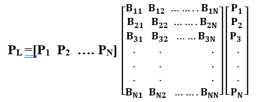
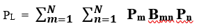
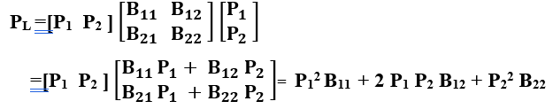
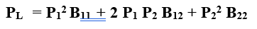
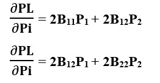
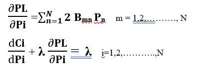
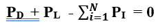
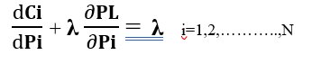

INTRODUCTION

The purpose of the electric utility or grid operator on an hour-by-hour basis is to lower the total cost of delivering electricity demand. The method by which the utility selects which of its generators will be utilized to meet demand for electricity is known as economic dispatch. Consider the following scenario for clearing the energy market: For the whole system, the utility creates a supply (marginal cost) curve. Demand is considered to be inelastic in terms of price (vertical demand curve). At the market-clearing point, the "System Lambda" is the marginal cost of producing anything (supply Equals demand). A "marginal unit" generator only provides enough electricity to meet a single kWh requirement. We'll go through the economic dispatch strategy using two different power production cost models. All marginal costs at power plants are considered to remain constant in the first model. The second implies that all marginal costs of power plants are linear (higher power results into an increase in the marginal cost).

CONCEPT

The advantages of the bus admittance matrix are as follows [5]:

FORMULAE

