### Basic Simulator:

#### The user has to provide the input values to run the simulator. The following steps help the user to explore the platform.

#### ●	Step 1: Navigate to the “Help” button and click on it.	

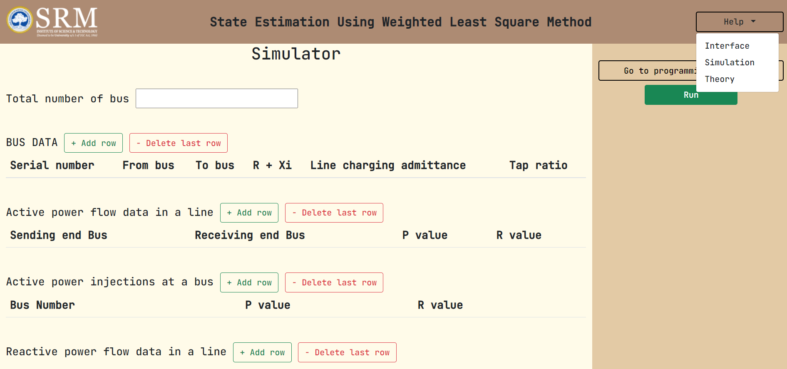

#### ●	Step 2: Navigate to “Theory” in the drop-down, and read the text for conceptual understanding.

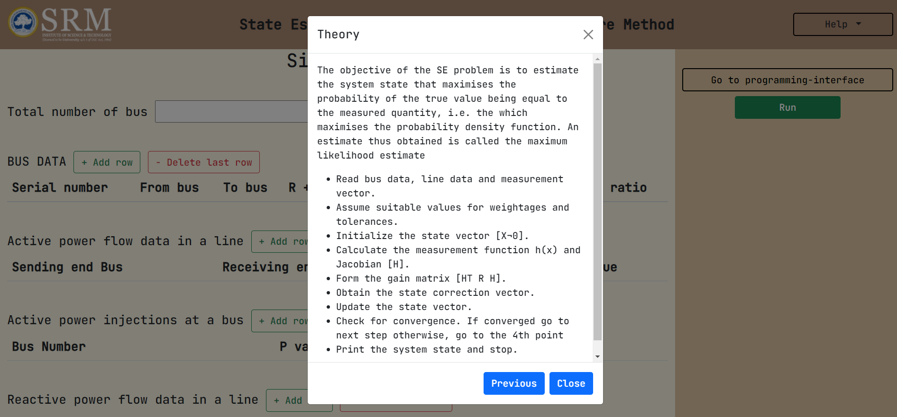

#### ●	Step 3: Navigate back to the interface.

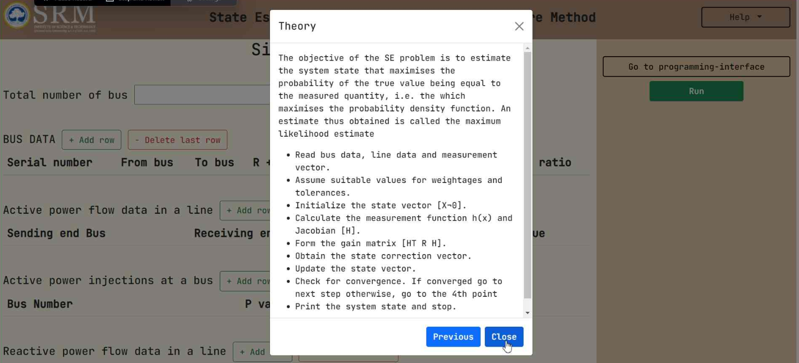

#### ●	Step 4: Enter the values for the input parameters on the display window.

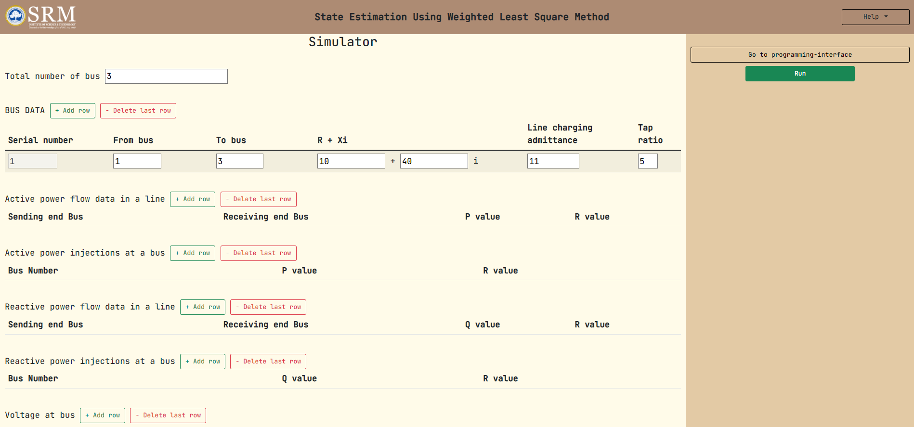

#### ●	Step 5: Click on the “Run” button. 

#### ●	Step 6: Navigate to “Results”.You can view the image provided below to navigate to the “Results” section on the simulator:

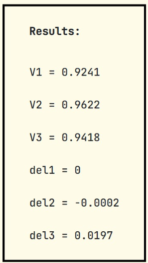

#### ●	Step 7: Verify the results provided by the simulator against manual calculations.

### The Programming Interface:

#### Your task here is to form an appropriate algorithm for understanding the experiment's workflow.

#### For forming the algorithm yourself, follow steps 1-10:

#### ●	Step 1: Navigate to the “Help” button and click on it.

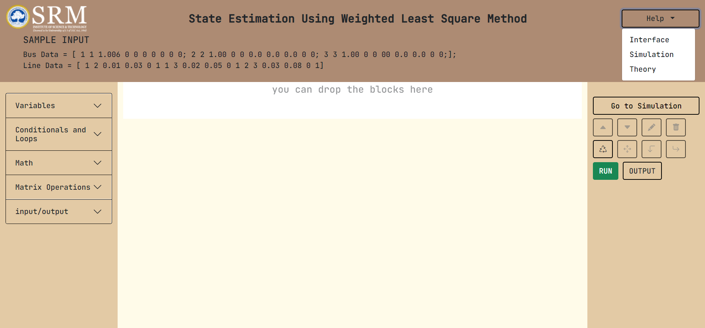

#### ●	Step 2: Navigate to “Theory” in the modal displayed, and read the text for conceptual understanding.

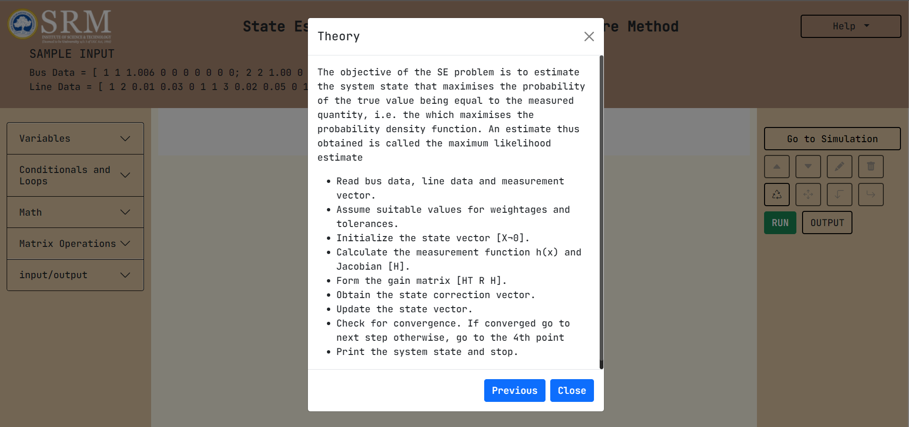

#### ●	Step 3: Navigate back to the interface.

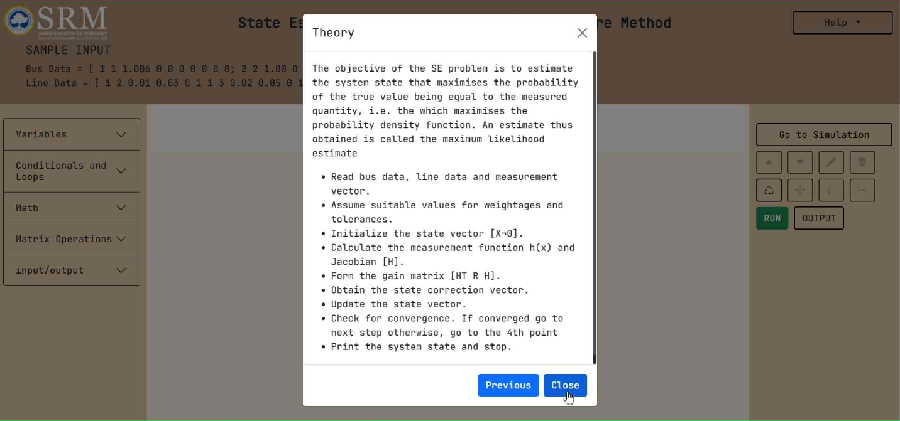

#### ●	Step 4: Use the palette provided on the left to navigate to the drag-drop elements/blocks. If required, please refer to the following image:

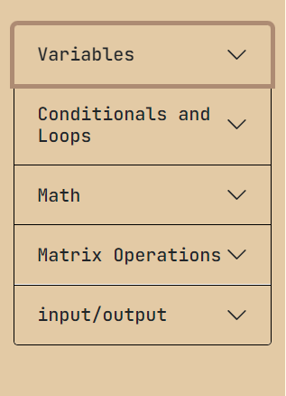 

#### ●	Step 5: Upon selecting the element/block, drag it to the specified area.

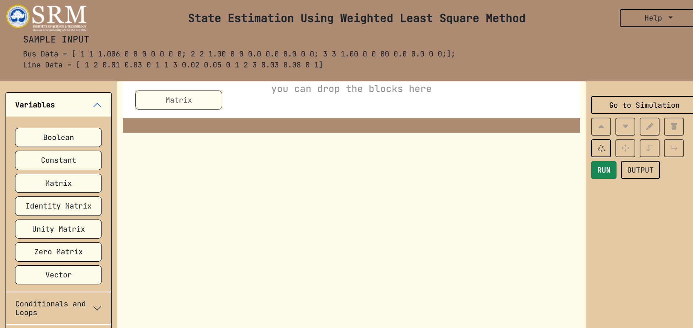

#### ●	Step 6: Name the elements/blocks appropriately.

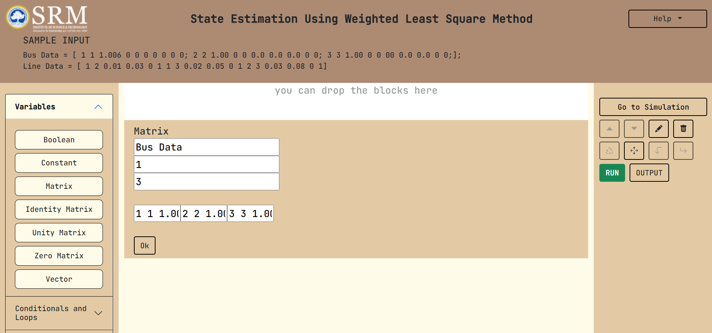

#### ●	Step 7: Fill in values for the elements/blocks chosen.

#### ●	Step 8: Click on the “Run” button. If required, you can view the image provided below to navigate to the “Run” button:

#### ●	Step 9: Verify the result against manual calculations.