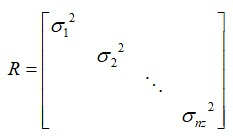
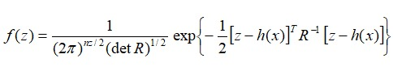
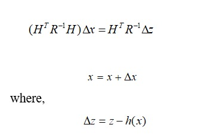
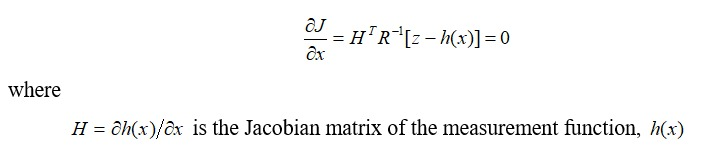

INTRODUCTION

The goal of the State Estimation (SE) problem is to estimate the state of the system in such a way that it maximizes the chance of the real value being equal to the measured quantity. The Weighted Least square (WLS) method minimizes the error squared while taking into account the precision of the measurement. 

CONCEPT

The non-linear equations relating the measurements   and the state vector,x = e+jf, using the measurement functions with the noise vector as z = h(x) + v

The values v vectors {V1,V2,...Vn} are assumed to be independent arbitrary variables with Gaussian distribution whose mean is zero. If the variance of the measurement error V1 is large, the corresponding measurement is not accurate. The measurement error covariance matrix R  is represented in terms of the variance; j=1,2,...nz of all  measurements as 

The measurements z are random variables as well. Moreover,   has a Gaussian distribution with mean and covariance R. 

To minimise the quadratic term in the exponent and the solution of the WLS problem of gives the estimated state  , which must satisfy the following condition:

where Jacobian matrix 

A SE solution is obtained by solve Eiteratively using Newetons’ method. The initial guess value is made from the most recent estimation. It may sometimes be initialised with a flat voltage profile, whose voltage magnitudes and their angles are assumed to be 1.0 per unit and 0.0 radians respectively. 