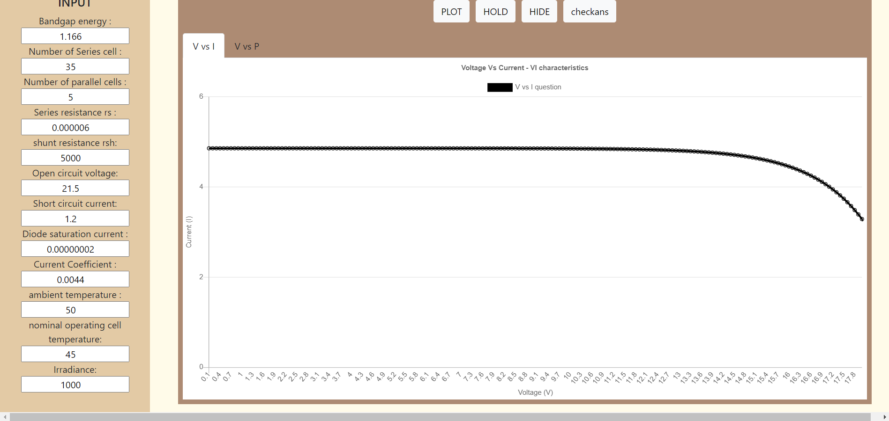
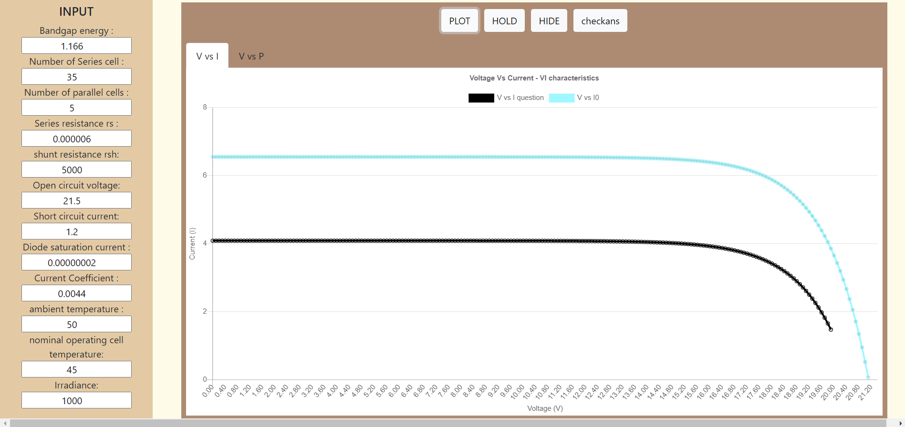
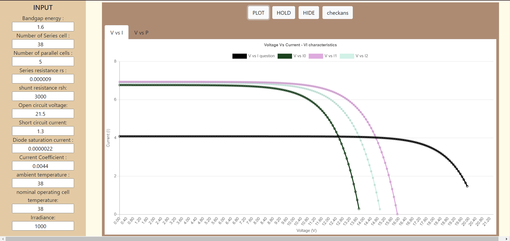

#### The user has to provide the input values to run the

#### simulator. The following steps help the user to explore the platform. 

#### 

 Step 1: Provide the values in respective input fields and click on "PLOT" button to plot a graph.
 
#### 
 Step 2: A new graph is plotted each time in both V vs I and V vs P when "PLOT" button is clicked.
#### 
 Step 3: If "HOLD" button and "PLOT" button are clicked consecutively, new graph and the previous graph can be viewed simultaneously.
#### 
 Step 4: This can be used to check the difference in the plot of the graphs when different inputs are given.

 Step 5: Simulator has a graph provided (black-colored) by default.
#### 

 Step 6: Change the input values and try to match the graph provided.