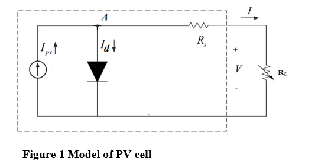

INTRODUCTION

The mathematical model of the Photovoltaic cell is presented in Figure 1. In which the real diode id tandem connected to an appropriate source of current. This appropriate source of current, generates current proportional to the solar radiance exposed to it. The practical PV cell model is exhibited by including the series resistance which also accounts the resistive losses. Also, the model can include the parallel resistor (Rp), which accounts certain loss in the spillage of current through intrinsic device.

Apply KCL at point A in Figure 1, in order to write the equation that follows.

<!--  -->

An ideal current source equation is given the ideal current equation the diode saturated current expression yields. The equations expressed below, comprise of the voltage and the current of the PV cell considering series resistances.

While the depiction of ‘q’ denotes the electric charge (1.062 x 10-19 C), “Isc” here, refers to the short circuit current. Moreover, ‘k’ acts as a Boltzmann Constant, with a value equaling to 1.381 x 10-23 J/K.

The series resistance and the parallel resistance (both being equivalent values) are denoted by “RS” and “RP” respectively. The junction temperature in Kelvin (K) is denoted by “T”.

Figure 2 portrays the current-voltage (I-V), and the power-voltage (P-V) characteristics of a typical PV cell. This experiment reveals the characteristics of any PV cell configuration in terms of P-V and I-V. In addition to that, the maximum power point of a given operating condition is visually determined.
